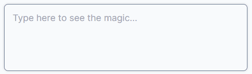
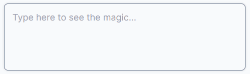

# react-textarea-list

[](https://badge.fury.io/js/react-textarea-list)


Drop-in replacement for the textarea component which automatically arranges user input into either unordered or ordered lists.

## Install

`npm install react-textarea-list`

## Demo

This package exposes two different list components - an unordered list and an ordered list. Both these components work like vanilla `<textarea />` elements and can be styled with CSS the same way.





Feel free to run the following commands to load the example on your local machine.

```bash
git clone https://github.com/jrobsontull/react-textarea-list.git
cd react-textarea-list
npm install
npm run start:example
```

## Usage

For an unordered list, import the `TextareaUL` component. You can customise the bullet character and use this component as a normal `<textarea />` element as this component exposes the usual properties.

```javascript
import { TextareaUL } from 'react-textarea-list';

const ExamplePage = () => {
  return (
    <div className="content">
      <TextareaUL
        bulletChar="- "
        placeholder="This is an unordered list..."
        onChange={(value) => console.log('The current value is: ' + value)}
      />
    </div>
  );
};

export default ExamplePage;
```

For a numbered list, import the `TextareaOL` component.

```javascript
import { TextareaOL } from 'react-textarea-list';

const ExamplePage = () => {
  return (
    <div className="content">
      <TextareaOL
        placeholder="This is an ordered list..."
        onChange={(value) => console.log('The current value is: ' + value)}
      />
    </div>
  );
};

export default ExamplePage;
```

## Props

The ordered and unordered textarea components expose slightly different props.

<h3 align="center" >TextareaUL</h3>

| Prop Name      | Type                         | Required | Default Value | Description                                                                                                                                            |
| -------------- | ---------------------------- | -------- | ------------- | ------------------------------------------------------------------------------------------------------------------------------------------------------ |
| `onChange`     | `(values: string[]) => void` | false    | n/a           | Called on every onChange event of the textarea. Works similarly to vanilla textarea onChange event.                                                    |
| `listOutput`   | `boolean`                    | false    | `true`        | When set to true, the onChange event returns a list of elements denoting each line. When false, the vanilla text with new line characters is returned. |
| `bulletChar`   | `string`                     | false    | `-`           | Character used as bullet points. Does not have to be a single character.                                                                               |
| `defaultValue` | `string`                     | false    | n/a           | Use to set the default value of the textarea.                                                                                                          |

<h3 align="center" >TextareaOL</h3>

| Prop Name    | Type                         | Required | Default Value | Description                                                                                                                                            |
| ------------ | ---------------------------- | -------- | ------------- | ------------------------------------------------------------------------------------------------------------------------------------------------------ |
| `onChange`   | `(values: string[]) => void` | false    | n/a           | Called on every onChange event of the textarea. Works similarly to vanilla textarea onChange event.                                                    |
| `listOutput` | `boolean`                    | false    | `true`        | When set to true, the onChange event returns a list of elements denoting each line. When false, the vanilla text with new line characters is returned. |

Apart from these, the component accepts all props that are accepted by `<textarea/>`, like `style`, `onChange`, `value`, etc.

## FAQ

#### How do I assign a `ref` to the component?

```javascript
import { createRef, useEffect } from 'react';
import { TextareaUL } from 'react-textarea-list';

const ExamplePage = () => {
  const myRef = createRef();

  useEffect(() => {
    console.log(myRef.current);
  }, []);

  return (
    <div className="content">
      <TextareaUL ref={myRef} />
    </div>
  );
};

export default ExamplePage;
```

#### How do I focus the component?

```javascript
import { createRef, useEffect } from 'react';
import { TextareaUL } from 'react-textarea-list';

const ExamplePage = () => {
  const myRef = createRef();

  useEffect(() => {
    myRef.current.focus();
  }, []);

  return (
    <div className="content">
      <TextareaUL ref={myRef} />
    </div>
  );
};

export default ExamplePage;
```

#### How do I autofocus the component?

```javascript
<TextareaUL autofocus />
```
